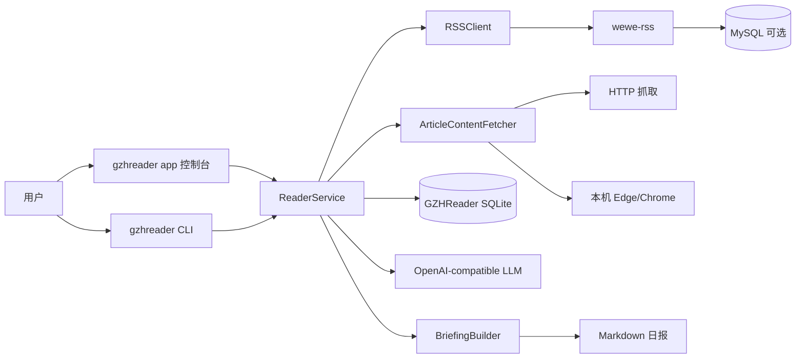

# GZHReader

> 把微信公众号阅读流，整理成一份真正可保存、可回看、可继续加工的日报。

GZHReader 是一个面向 Windows 的微信公众号日报整理工具。它不是“手工维护一堆 RSS 源”的阅读器，而是一条完整的本地工作流：

`微信公众号 -> wewe-rss -> all.atom -> GZHReader -> SQLite -> LLM 总结 -> Markdown 日报`

当前项目的正式产品形态是：**GUI 为主，CLI 为辅；本地运行，支持打包成 Windows 安装程序。**

## 为什么值得用

- 用图形控制台串起环境检查、RSS 服务、LLM 配置、结果输出和计划任务
- 不需要手工维护一堆 `feeds[]`，默认只消费一个聚合源 `all.atom`
- RSS 正文不完整时，可以继续补抓正文，再生成摘要
- 最终产物是 `Markdown` 日报，适合归档、搜索、同步和二次加工
- 核心运行记录保存在本地 SQLite，方便重复执行、去重和追踪

## 快速开始

### 作为最终用户使用

1. 安装并启动 Docker Desktop
2. 运行 `GZHReader.exe`
3. 在控制台中启动 `wewe-rss`
4. 打开 `wewe-rss` 后台，扫码登录并订阅公众号
5. 填写 LLM 配置
6. 选择 Markdown 输出目录
7. 立即运行一次，或安装每日计划任务

### 从源码运行

```powershell
python -m venv .venv
.\.venv\Scripts\activate
pip install -e .
gzhreader app
```

如果你想先生成默认配置：

```powershell
gzhreader init
```

### 常用命令

```powershell
gzhreader app
gzhreader doctor
gzhreader run today
gzhreader run date 2026-03-07
gzhreader schedule install
gzhreader schedule remove
gzhreader wewe-rss init
gzhreader wewe-rss up
gzhreader wewe-rss down
gzhreader wewe-rss logs
```

## 架构与数据流



### 一次完整运行会发生什么

1. `wewe-rss` 把公众号内容转成标准 RSS / Atom
2. GZHReader 从 `source.url` 读取聚合源，默认是 `all.atom`
3. GZHReader 过滤目标日期内的文章，并写入本地 SQLite
4. 如果 RSS 没带够正文，则尝试 HTTP / 浏览器补抓
5. GZHReader 调用 OpenAI 兼容接口生成摘要
6. 最终生成 `output/briefings/YYYY-MM-DD.md`

## 镜像和数据库分别做什么

很多人第一次看这个项目会搞混 `wewe-rss`、`mysql`、SQLite 和最终日报。下面这张表是最重要的理解入口。

| 组件 | 是否必须 | 作用 | 普通用户要不要关心 |
| --- | --- | --- | --- |
| Docker Desktop | 是 | 负责在本机启动 `wewe-rss` / `mysql` 容器 | 要，必须先装并启动 |
| `cooderl/wewe-rss:latest` | 是 | 把公众号内容变成可消费的 RSS / Atom，并提供 Web 后台 | 要，会在控制台里启动和打开它 |
| `mysql:8.4` | 仅 `compose_variant=mysql` 时启用 | 给 `wewe-rss` 容器提供数据库 | 通常不用手动操作 |
| GZHReader 自己的 SQLite | 是 | 保存文章、摘要、运行记录、日报元数据 | 不用手动管理 |
| Markdown 日报 | 是 | 最终产物，给你阅读、归档、同步和再加工 | 要，这是你最终会看的结果 |

### `AUTH_CODE` 是什么

- `AUTH_CODE` 是进入本地 `wewe-rss` 管理页的访问码
- 它**不是**微信账号密码，也**不是** OpenAI API Key
- 它只是 `wewe-rss` 本地后台的一层访问保护

### MySQL 密码是干什么的

- `MYSQL_ROOT_PASSWORD` / `MYSQL_PASSWORD` 是 **本地 MySQL 容器** 的凭据
- 它们主要给 `wewe-rss` 容器自己连库使用
- 普通用户通常不需要记住或手动使用它们
- 如果你切到 `compose_variant = sqlite`，则不会启动 MySQL，也不需要关心这些密码

### 哪个数据库才是 GZHReader 自己的数据库

是 **SQLite**。

默认路径：

- 开发环境：`data/gzhreader.db`
- 安装版：`%APPDATA%\GZHReader\data\gzhreader.db`

它负责保存：

- 文章去重与正文内容
- 摘要结果
- 每次运行的状态与结果

## 仓库结构

```text
GZHReader/
├─ src/gzhreader/
│  ├─ cli.py                 CLI 入口与命令编排
│  ├─ webapp.py              本地 Web 控制台与交互逻辑
│  ├─ service.py             日报主流程编排
│  ├─ rss_client.py          聚合 RSS 读取与日期过滤
│  ├─ article_fetcher.py     正文补抓（HTTP / 浏览器）
│  ├─ summarizer.py          OpenAI 兼容摘要调用
│  ├─ storage.py             SQLite 存储层
│  ├─ briefing.py            Markdown 日报生成
│  ├─ scheduler.py           Windows 计划任务安装/删除
│  ├─ wewe_rss.py            bundled `wewe-rss` 脚手架与运行管理
│  ├─ runtime_paths.py       开发环境 / 安装版路径切换
│  ├─ templates/             控制台 HTML 模板
│  └─ static/                前端静态资源
├─ tests/                    自动化测试
├─ scripts/                  打包与计划任务脚本
├─ packaging/                PyInstaller / Inno Setup 配置与资源
├─ infra/wewe-rss/           compose 模板目录
├─ config.example.yaml       示例配置
├─ pyproject.toml            Python 项目元数据
├─ CHANGELOG.md              发版记录
└─ LICENSE                   许可证
```

### 代码结构怎么理解最省力

- **入口层**：`cli.py`、`webapp.py`、`console_entry.py`、`gui_entry.py`
- **业务流程层**：`service.py`、`briefing.py`
- **基础能力层**：`rss_client.py`、`article_fetcher.py`、`summarizer.py`、`storage.py`
- **运行环境层**：`runtime_paths.py`、`scheduler.py`、`wewe_rss.py`
- **展示层**：`templates/`、`static/`
- **验证层**：`tests/`

## 配置说明

示例文件：`config.example.yaml`

最关键的配置项通常只有这些：

- `source.url`：聚合源地址，默认是 `http://localhost:4000/feeds/all.atom`
- `rss.daily_article_limit`：当天最多处理多少篇文章，支持数字或 `all`
- `llm.base_url` / `llm.model` / `llm.api_key`：摘要模型配置
- `output.briefing_dir`：Markdown 日报输出目录
- `wewe_rss.compose_variant`：`mysql` 或 `sqlite`
- `wewe_rss.auth_code`：本地 `wewe-rss` 后台访问码

默认不应该提交到 GitHub 的本地文件包括：

- `config.yaml`
- `data/`
- `output/`
- `build/`
- `dist/`
- `release/`
- `infra/wewe-rss/.env`

## 打包发布

### 仅构建 PyInstaller 产物

```powershell
.\scripts\build_release.ps1 -SkipInstaller
```

输出目录：`dist/GZHReader/`

### 构建 Windows 安装包

先安装 `Inno Setup 6`，然后运行：

```powershell
.\scripts\build_release.ps1
```

输出目录：`release/`

相关文件：

- `packaging/pyinstaller/GZHReader.spec`
- `packaging/inno/GZHReader.iss`
- `scripts/build_release.ps1`

## 版本号怎么改

从现在开始，**版本号只改一个地方**：

- `src/gzhreader/__init__.py`

也就是修改：

```python
__version__ = "0.2.0"
```

然后重新执行构建脚本：

```powershell
.\scripts\build_release.ps1
```

构建链路会使用同一个版本源去驱动：

- Python 包元数据
- 安装器版本号
- 默认 `User-Agent`

## CHANGELOG 是干什么的

`CHANGELOG.md` 用来记录每个版本新增了什么、修了什么、行为有什么变化。

它的价值很实际：

- 方便你自己回忆每次发版改了什么
- 方便使用者判断是否值得升级
- 方便 GitHub Release 直接整理发版说明
- 方便以后定位“这个行为从哪个版本开始改变的”

如果你准备长期维护，这个文件非常有用。

## FAQ

### 为什么现在只有一个 `source`？

因为当前产品形态已经切到“聚合源模式”。普通用户只需要关心 `all.atom`，而不是自己维护多条 RSS 源。

### 为什么只有一个源，日报里还能区分不同公众号？

因为聚合源里的每篇文章仍然带有作者信息，GZHReader 会按作者自动分组。

### 为什么最后只看到 `.md`，看不到 HTML？

因为 Markdown 是默认成品，原始 HTML 归档默认关闭，只在你明确开启 `output.save_raw_html` 时才会保存。

### 最终用户也需要 Docker Desktop 吗？

需要。当前版本把 `wewe-rss` 当作正式工作流的一部分，但 Docker Desktop 本身不会被打包进安装器。

### `wewe-rss`、MySQL、SQLite、Markdown 之间的关系怎么记？

一句话：

- `wewe-rss` 负责“把公众号变成 RSS”
- `mysql` 只是在 MySQL 方案下给 `wewe-rss` 提供数据库
- SQLite 是 GZHReader 自己的数据底座
- Markdown 是最后给你看的成品

## 免责声明

本项目依赖第三方服务与接口，包括但不限于 Docker Desktop、`wewe-rss`、浏览器环境和 OpenAI 兼容 LLM API。发布和分发成品前，请自行确认你的使用方式与相关服务条款相符。
