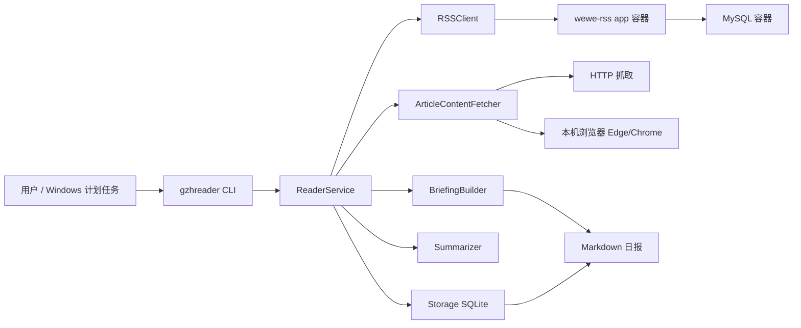
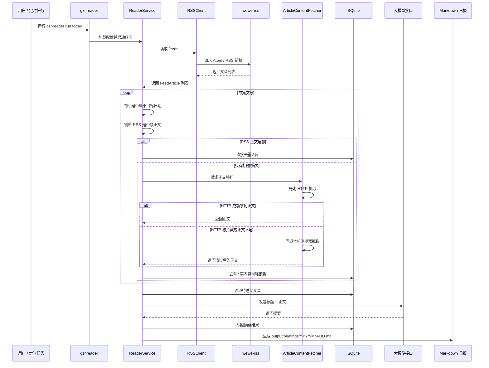

# GZHReader

GZHReader 是一个运行在 Windows 上的“微信公众号日报整理工具”。

它的目标很简单：

- 先把你关注的公众号文章变成标准 RSS/Atom 源
- 再由 Python 程序自动抓取当天文章
- 如果 RSS 里只有标题或摘要，就自动补抓正文
- 最后调用大模型生成摘要，并输出为 Markdown 日报

这个项目已经不再使用微信桌面版 UI 自动化。当前正式方案是：**`wewe-rss + MySQL + GZHReader`**。

## 一句话整体链路

`微信公众号 -> wewe-rss -> RSS/Atom -> GZHReader -> SQLite -> 大模型总结 -> Markdown 日报`

你最终真正会用到、会打开的结果文件，是：

- `output/briefings/YYYY-MM-DD.md`

## 架构图



## 数据流图



## 这套系统到底是怎么工作的

可以把它理解成 3 层：

### 第 1 层：RSS 生产层

这层不是 GZHReader 自己完成的，而是靠 `wewe-rss`。

它负责：

- 登录你的微信生态账号（通过 `wewe-rss` 后台扫码）
- 订阅你指定的公众号
- 把公众号文章整理成标准的 RSS / Atom 链接

也就是说，**GZHReader 本身不会直接去“登录微信抓公众号”**。它只消费已经准备好的 RSS。

### 第 2 层：日报生成层

这层才是 GZHReader 自己负责的核心工作：

- 读取 `config.yaml`
- 从 `wewe-rss` 提供的 RSS 链接中拉文章
- 过滤出当天新文章
- 判断 RSS 是否已经带完整正文
- 如果正文不够，就自动补抓
- 存进本地 SQLite 数据库
- 调用大模型生成摘要
- 输出 Markdown 日报

### 第 3 层：计划任务层

如果你安装了 Windows 计划任务，它只是每天帮你自动执行一次：

- `gzhreader run today`

所以计划任务不是另一个系统，它只是一个“自动按时点按钮的人”。

## 为什么会有两个容器

这是你最容易困惑的地方，我直接用最白话的方式解释。

### 容器 1：`wewe-rss-app`

这个容器是真正提供 RSS 服务的应用。

你可以把它理解成：

- 一个小网站后台
- 一个 RSS 生产器
- 一个“把公众号内容整理成 Atom/RSS 链接”的程序

它会对外提供类似这样的地址：

- `http://localhost:4000/feeds/all.atom`

GZHReader 读取的就是这个地址。

### 容器 2：`mysql`

这个容器不是多余的，它是给 `wewe-rss-app` 存数据用的数据库。

你可以把它理解成：

- `wewe-rss-app` 的记忆仓库
- 用来保存订阅信息、后台数据、服务状态

没有这个数据库，`wewe-rss-app` 就没法长期稳定保存自己的数据。

### 关键结论

对当前项目的默认方案来说：

- **GZHReader 本身不是容器化运行的**，它是你在 Windows 本机直接执行的 Python 命令
- **双容器只服务于 `wewe-rss`**
- 但是因为当前项目把 `wewe-rss` 作为**必须组件**，所以别人使用你的项目时，也需要先把这两个容器跑起来

换句话说：

- 你的 Python 程序负责“整理日报”
- 两个容器负责“生产公众号 RSS”

## 还有一个 SQLite，它和 MySQL 是什么关系

这里其实有 **两套数据库**，但职责完全不同：

### `mysql` 容器里的数据库

这是 `wewe-rss` 自己用的。

它负责：

- 保存 `wewe-rss` 的后台数据
- 维持 RSS 服务正常工作

### 项目里的 `data/gzhreader.db`

这是 GZHReader 自己的本地 SQLite。

它负责：

- 保存已抓取文章
- 去重，避免重复总结
- 保存运行记录
- 保存摘要结果
- 支持补跑时增强旧文章

所以不要把它们混在一起：

- `MySQL` = 给 `wewe-rss` 用
- `SQLite` = 给 `GZHReader` 用

## 小白版上手步骤

下面是你或者别人第一次使用这个项目的标准流程。

### 1. 准备 Python 环境

```powershell
python -m venv .venv
.\.venv\Scripts\Activate.ps1
pip install -e .[dev]
```

### 2. 初始化项目

```powershell
gzhreader init
```

这一步会做几件事：

- 生成 `config.yaml`
- 创建 Markdown 输出目录
- 生成 `infra/wewe-rss` 下的 Docker Compose 文件

### 3. 启动两个容器

```powershell
gzhreader wewe-rss up
```

启动后，你在 Docker Desktop 里会看到两项：

- `wewe-rss-app-1`
- `wewe-rss-mysql-1`

这就是默认方案里的“双容器”。

### 4. 登录 wewe-rss 后台

浏览器打开：

- `http://localhost:4000`

然后：

1. 输入授权码（默认 `123567`）
2. 按页面提示扫码登录
3. 添加你要订阅的公众号
4. 复制生成的 Atom / RSS 链接

### 5. 把 RSS 链接写进 `config.yaml`

你要在 `feeds` 里配置文章源，例如：

```yaml
feeds:
  - name: 全部公众号
    url: http://localhost:4000/feeds/all.atom
    active: true
    order: 1
```

### 6. 检查环境

```powershell
gzhreader doctor
```

这一步会检查：

- 配置文件是否能读取
- RSS 依赖是否正常
- HTTP / 浏览器正文抓取能力是否可用
- SQLite 是否能初始化
- Docker 与 `wewe-rss` 是否正常
- LLM 接口是否连通

### 7. 运行一次日报生成

```powershell
gzhreader run today
```

或者跑某一天：

```powershell
gzhreader run date 2026-03-07
```

### 8. 查看最终结果

你最终要看的文件是：

- `output/briefings/YYYY-MM-DD.md`

例如：

- `output/briefings/2026-03-07.md`

## 正文抓取是怎么回事

RSS 有时候只会给你：

- 标题
- 短摘要
- 原文链接

这时 GZHReader 会自动补抓正文，顺序固定为：

1. 先走 HTTP 请求原文页
2. 如果微信拦截、正文太短、或拿到的是验证码页
3. 再回退到本机浏览器（优先 Edge，再回退 Chrome）
4. 从浏览器渲染后的页面里提取正文

所以你日志里常见的情况是：

- HTTP 请求成功，但拿到的是微信拦截页
- 然后浏览器回退成功
- 最终 `content_source = browser_dom`

这说明：

- **不是 HTTP 真正抓到了原文**
- 而是 **浏览器回退抓到了正文**

## 输出说明

当前正式输出只有一种：

- Markdown 日报：`output/briefings/YYYY-MM-DD.md`

从这次版本开始，项目默认：

- **不再把原始 HTML 额外保存为本地文件**
- 即 `output.save_raw_html: false`

这样做的原因很简单：

- 你真正需要的是摘要结果，而不是一堆 `.html`
- HTML 文件体积大、可读性差、容易让新手困惑
- 默认关闭后，项目产物会更干净

如果以后你要调试抓取问题，仍然可以把配置打开：

```yaml
output:
  briefing_dir: ./output/briefings
  raw_archive_dir: ./output/raw
  save_raw_html: true
  log_level: INFO
```

## 当前最常用命令

```powershell
gzhreader init
gzhreader doctor
gzhreader run today
gzhreader run date 2026-03-07
gzhreader run today --feed 全部公众号

gzhreader schedule install
gzhreader schedule remove

gzhreader wewe-rss up
gzhreader wewe-rss down
gzhreader wewe-rss logs
```

## 常见问题

### 1. 如果别人使用我的项目，也需要这两个容器吗？

需要。

因为当前项目定位是：

- **内置 `wewe-rss` 作为公众号 RSS 生产方案**

所以别人要用你的项目，标准流程也是：

1. 先启动 `wewe-rss-app`
2. 再让 `mysql` 作为它的数据库一起启动
3. 登录 `wewe-rss`
4. 获取 RSS / Atom 链接
5. 再让 GZHReader 去消费这些链接

### 2. 如果我看到两个容器，不要慌，分别是干什么的？

记住一句话就够了：

- `app` 负责干活
- `mysql` 负责记账

也就是：

- `wewe-rss-app` 负责提供 RSS 服务
- `mysql` 负责保存它的数据

### 3. GZHReader 自己是容器吗？

不是。

GZHReader 是你在 Windows 上直接运行的 Python 程序。

### 4. 为什么最终只看到 md，不再看到 html？

因为项目现在默认关闭 HTML 文件落盘。

你的最终结果应该是：

- `output/briefings/YYYY-MM-DD.md`

HTML 现在默认不是交付物，只是未来调试时可选打开的能力。

### 5. 如果我只想每天自动生成一份日报，需要一直开着程序吗？

不需要。

你只要安装 Windows 计划任务：

```powershell
gzhreader schedule install
```

之后每天到设定时间，它会自动执行一次：

- `gzhreader run today`

## 默认配置示例

```yaml
db_path: ./data/gzhreader.db
feeds:
  - name: 全部公众号
    url: http://localhost:4000/feeds/all.atom
    active: true
    order: 1

schedule:
  daily_time: '21:30'
  timezone: Asia/Shanghai

rss:
  timezone: Asia/Shanghai
  day_start: '00:00'
  request_timeout_seconds: 20
  user_agent: GZHReader/0.2
  max_articles_per_feed: 20

wewe_rss:
  enabled: true
  base_url: http://localhost:4000
  auth_code: '123567'
  service_dir: ./infra/wewe-rss
  compose_variant: mysql
  port: 4000
  server_origin_url: http://localhost:4000
  image: cooderl/wewe-rss:latest

article_fetch:
  enabled: true
  trigger: missing_rss_content
  mode: hybrid
  timeout_seconds: 20
  browser_channel_order:
    - msedge
    - chrome
  max_content_chars: 12000

llm:
  base_url: https://api.openai.com/v1
  api_key: ''
  model: gpt-4o-mini
  timeout_seconds: 45
  retries: 2
  temperature: 0.2

output:
  briefing_dir: ./output/briefings
  raw_archive_dir: ./output/raw
  save_raw_html: false
  log_level: INFO
```
