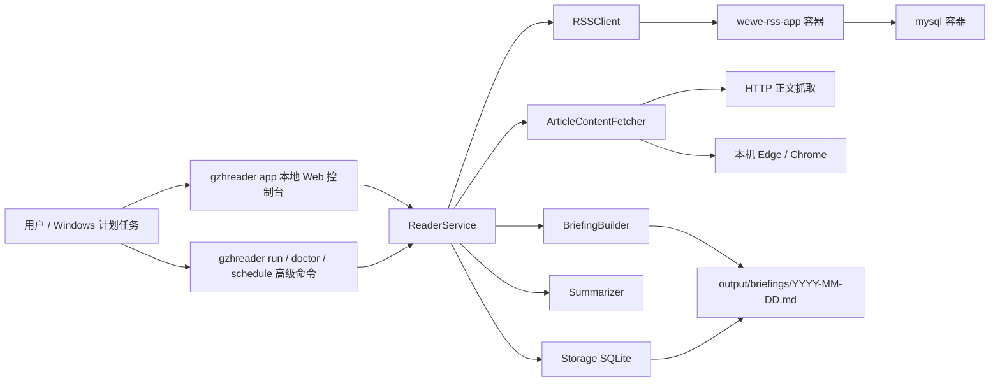
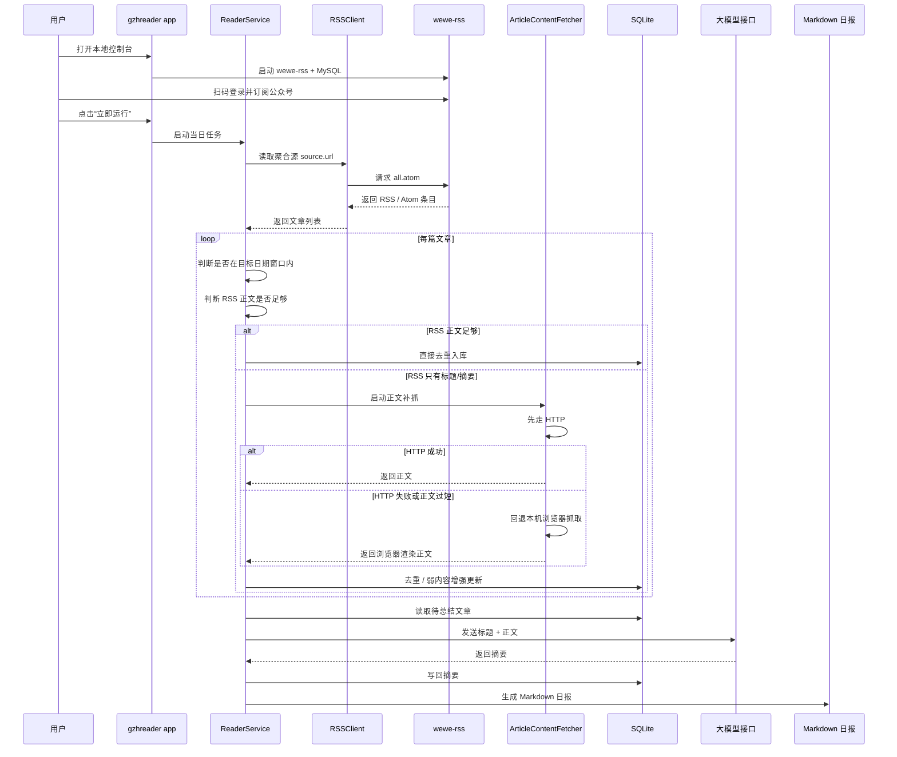

# GZHReader

GZHReader 是一个面向 Windows 的“微信公众号日报整理工具”。

它现在的正式产品形态是：**GUI 为主，CLI 为辅**。

普通用户的推荐用法是：

- 启动本地控制台 `gzhreader app`
- 在网页里一键启动 `wewe-rss + MySQL`
- 打开 `wewe-rss` 后台扫码登录并订阅公众号
- 填写 LLM 配置
- 点击“立即运行”生成 Markdown 日报

整个项目已经**不再使用微信桌面版 UI 自动化**。当前唯一正式链路是：

`公众号 -> wewe-rss 聚合源 all.atom -> GZHReader -> SQLite -> LLM -> Markdown 日报`

默认输出只有一个核心产物：

- `output/briefings/YYYY-MM-DD.md`

默认**不会**再保存原始 HTML。

---

## 项目简介

你可以把 GZHReader 理解成一条“自动整理资讯”的流水线：

1. `wewe-rss` 把公众号文章变成标准 RSS / Atom
2. GZHReader 从聚合源 `all.atom` 读取文章
3. 如果 RSS 没带完整正文，GZHReader 自动补抓正文
4. GZHReader 调用大模型生成摘要
5. 最后输出成一份当天的 Markdown 日报

这意味着：

- **GZHReader 不直接登录微信后台抓文章**
- **GZHReader 不要求你手工维护很多 feed 配置**
- **GZHReader 默认只认一个聚合源：`all.atom`**

日报里仍然会按 RSS 条目里的 `author` 自动分组，所以即使只有一个聚合源，最终输出依然会按公众号区分。

---

## 一句话整体链路

`公众号 -> wewe-rss -> all.atom -> GZHReader -> SQLite -> 大模型总结 -> Markdown 日报`

---

## 架构图



---

## 数据流图



---

## 运行原理详解

### 1. 为什么现在只保留一个聚合源

旧版本里最容易让普通用户困惑的地方，就是 `feeds[]`。

因为它会让人误以为：

- 每个公众号都要手工写一条配置
- `name` 一定要和公众号名严格对应
- URL 不对就整个系统不能用

现在的思路更简单：

- 普通用户只需要一个源：`all.atom`
- 这个源由 `wewe-rss` 统一输出
- GZHReader 读取后，会根据文章里的 `author` 自动分组

所以你在配置里看到的重点不再是 `feeds[]`，而是：

```yaml
source:
  mode: aggregate
  url: http://localhost:4000/feeds/all.atom
```

如果你之前用的是旧版配置，程序会自动迁移，并备份为：

- `config.yaml.bak`

### 2. 为什么会有两个容器

这是整个项目里最容易让新手困惑的地方。

请直接这样理解：

- `wewe-rss-app` = “把公众号变成 RSS 的应用”
- `mysql` = “给 `wewe-rss-app` 保存数据的数据库”

它们不是两个不同项目，而是**同一个 RSS 服务的两个组成部分**。

#### `wewe-rss-app` 负责什么

它负责：

- 提供 `wewe-rss` Web 后台
- 让你扫码登录
- 让你订阅公众号
- 把订阅结果输出成 RSS / Atom 地址

#### `mysql` 负责什么

它负责：

- 给 `wewe-rss-app` 保存自己的数据
- 记住你订阅了哪些公众号
- 维持 RSS 服务的持久化状态

### 3. 为什么还有一个 SQLite

项目里实际上有两套数据库，但用途不同：

#### `mysql` 容器

这是 `wewe-rss` 自己的数据库。

它只服务于：

- 登录信息
- 订阅信息
- RSS 服务内部状态

#### `data/gzhreader.db`

这是 GZHReader 自己的本地 SQLite。

它服务于：

- 文章去重
- 运行记录
- 正文增强后的内容
- 摘要结果
- 日报缓存

一句话总结：

- `mysql` 是给 `wewe-rss` 用的
- `SQLite` 是给 `GZHReader` 用的

### 4. 正文补抓是怎么做的

RSS 并不总是带完整正文，所以 GZHReader 会按下面顺序补抓：

1. **先看 RSS 有没有完整正文**
2. 如果 RSS 只有标题或摘要：
   - 先走 **HTTP 正文抓取**
   - 失败后回退到 **本机 Edge / Chrome 浏览器抓取**
3. 如果两种方式都失败：
   - 仍继续运行
   - 退回到“标题/摘要总结”

所以单篇文章抓取失败，不会阻断整天任务。

### 5. 为什么最终只看到 `.md`

因为现在项目默认只保留最终结果：

- `output/briefings/YYYY-MM-DD.md`

原始 HTML 归档已经默认关闭：

```yaml
output:
  save_raw_html: false
```

这意味着：

- 默认不会再写 `output/raw/*.html`
- 你平时只需要关心 Markdown 日报
- 如果以后要做调试，再打开这个高级开关即可

---

## 小白版上手步骤

### 1. 安装 Python 依赖

```powershell
python -m venv .venv
.\.venv\Scripts\Activate.ps1
pip install -e .[dev]
```

### 2. 直接启动 GUI

```powershell
gzhreader app
```

第一次启动时，如果还没有 `config.yaml`，程序会自动创建默认配置。

本地控制台会固定启动在：

- `http://127.0.0.1:8765`

### 3. 在 GUI 里按顺序完成首屏引导

推荐顺序：

1. 检查 Docker Desktop
2. 点击“启动 RSS 服务”
3. 点击“打开 wewe-rss 登录页”
4. 在 `wewe-rss` 后台扫码登录
5. 在 `wewe-rss` 后台添加你想订阅的公众号
6. 回到 GZHReader，填写 LLM 配置
7. 设置计划任务
8. 点击“立即运行”

### 4. 查看输出

生成成功后，结果会保存在：

- `output/briefings/YYYY-MM-DD.md`

你也可以在 GUI 里直接点击最近生成的日报进行查看。

---

## 容器说明

### 默认方案

当前项目默认且推荐的 RSS 生产方案是：

- `wewe-rss + MySQL`

也就是说，**对使用本项目的人来说，这两个容器是必须组件**。

你不需要自己理解 Docker Compose 细节，但你需要知道：

- 没有 `wewe-rss-app`，就没有 RSS
- 没有 `mysql`，`wewe-rss-app` 就没法正常保存数据

### 如果你在 Docker Desktop 里看到两个容器，不要慌

这是正常现象。

你可以把它想成：

- 一个容器是“应用”
- 一个容器是“应用的数据库”

它们应该一起启动、一起停止。

在 GZHReader GUI 中，你只需要按按钮：

- 启动 RSS 服务
- 停止 RSS 服务
- 打开 `wewe-rss` 登录页
- 重新检查状态

普通用户不需要手敲容器命令。

---

## 输出说明

### 默认输出

- 日报：`output/briefings/YYYY-MM-DD.md`
- 本地业务数据库：`data/gzhreader.db`

### 默认不再输出

- 原始 HTML 归档

除非你在高级模式里手动打开：

```yaml
output:
  save_raw_html: true
```

---

## 配置说明

普通用户基本只需要理解下面这几块：

```yaml
wewe_rss:
  base_url: http://localhost:4000

source:
  mode: aggregate
  url: http://localhost:4000/feeds/all.atom

llm:
  base_url: https://api.openai.com/v1
  api_key: "..."
  model: gpt-4o-mini

rss:
  daily_article_limit: 20

schedule:
  daily_time: "21:30"

output:
  briefing_dir: ./output/briefings
```

### 关于 `source.url`

普通用户不需要自己改它。

默认就是：

- `http://localhost:4000/feeds/all.atom`

它表示“读取 `wewe-rss` 提供的全部公众号聚合源”。

### 关于 `rss.daily_article_limit`

这个名字的意思是：**GZHReader 每天最多处理多少篇文章**。

它不是：

- 你订阅了多少个公众号
- `wewe-rss` 里最多保存多少篇文章
- 公众号后台里会显示多少条历史内容

它真正控制的是：

- 在你运行当天日报时，GZHReader 最多拿多少篇“属于目标日期的文章”进入后续流程
- 这个设置同时影响“立即运行”和“每日计划任务”

当前 GUI 提供这些预设：

- `当天全部`
- `每天最多 20 篇`
- `每天最多 30 篇`
- `每天最多 40 篇`
- `每天最多 50 篇`
- `每天最多 100 篇`

其中：

- `当天全部` = 处理 **RSS 聚合源当前能看到的、属于目标日期的全部文章**
- `20 / 30 / 40 / 50 / 100` = 限制当天最多处理对应数量的文章，用于控制耗时和大模型成本

处理顺序也已经固定为：

1. 先读取聚合源当前返回的文章
2. 先筛出“目标日期”的文章
3. 再应用 `daily_article_limit` 上限
4. 最后才进入正文补抓、去重、总结、生成 Markdown

### 关于旧版 `feeds[]`

旧版里你可能看到过：

```yaml
feeds:
  - name: 新智元
    url: ...
```

这套结构现在已经降级为兼容迁移用途。GUI 和新文档都不再要求普通用户理解它。

---

## 高级命令行入口

虽然现在是 GUI 优先，但 CLI 仍然保留给高级用户：

```powershell
gzhreader app
gzhreader doctor
gzhreader run today
gzhreader run date 2026-03-07
gzhreader schedule install
gzhreader schedule remove
gzhreader wewe-rss up
gzhreader wewe-rss down
gzhreader wewe-rss logs
```

说明：

- `gzhreader app` 是主入口
- `gzhreader run ...` 仍可用于计划任务和自动化
- `--feed` 已进入废弃状态，因为当前版本固定使用聚合源

---

## 常见问题

### 1. 为什么我的配置里没有公众号名字了？

因为现在对普通用户只暴露一个聚合源 `all.atom`。

真正的公众号分组来自 RSS 条目的 `author` 字段，而不是你手工写的配置名。

### 2. 为什么明明只有一个 `source`，日报里还能区分不同公众号？

因为 `all.atom` 里面每篇文章都带作者信息，GZHReader 会按作者自动分组。

### 3. 为什么以前总看到 “20”，现在它到底限制的是什么？

这里的 `20` 指的不是公众号数量，也不是 RSS 源永久只保留 20 篇。

它表示的是：**GZHReader 每天最多处理 20 篇属于目标日期的文章**。

也就是说，程序现在会：

1. 先读取 RSS 聚合源当前返回的文章
2. 先筛出你要生成日报那一天的文章
3. 再按 `rss.daily_article_limit` 决定最多处理多少篇

如果你选：

- `当天全部`：尽量处理 RSS 聚合源当前能看到的、属于该日期的全部文章
- `20 / 30 / 40 / 50 / 100`：只处理当天最多对应数量的文章

数量越大：

- 正文补抓次数越多
- 整体运行时间越长
- 大模型总结成本越高

### 4. 为什么我最终只看到 `.md`，看不到 HTML？

因为 HTML 归档默认关闭了，这是故意简化后的行为。

### 5. 别人使用这个项目，也需要那两个容器吗？

需要。

因为你当前项目把 `wewe-rss` 作为内置、默认、必须的 RSS 生产方案，所以别人也要先把这套服务启动起来。

### 6. 如果我以前已经有旧版配置怎么办？

程序会自动迁移：

- 旧文件会备份为 `config.yaml.bak`
- 旧的 `rss.max_articles_per_feed` 会迁移成新的 `rss.daily_article_limit`
- 新文件会切换到 `source` 结构

### 7. 项目最终会不会提供安装包？

当前仓库仍以 Python 项目形式运行，但目标发布形态已经确定为：

- Windows 安装程序 `.exe`

计划方向是：

- `PyInstaller one-dir`
- `Inno Setup` 安装器

---

## 当前默认目录结构

```text
config.yaml
data/
  gzhreader.db
infra/
  wewe-rss/
output/
  briefings/
    YYYY-MM-DD.md
src/
  gzhreader/
```

---

## 当前推荐使用方式

如果你是普通用户，请只记住这一条：

```powershell
gzhreader app
```

然后在本地控制台里完成剩下所有操作。

---

## 安装版打包与默认目录

如果你要生成正式的 Windows 成品安装包，请使用：

```powershell
.\scripts\build_release.ps1
```

构建完成后：

- 安装包输出到 `release/`
- PyInstaller 产物输出到 `dist/GZHReader/`

安装版默认会把运行时文件分开存放到用户目录：

- 配置文件：`%APPDATA%\GZHReader\config.yaml`
- SQLite 数据库：`%APPDATA%\GZHReader\data\gzhreader.db`
- `wewe-rss` 编排目录：`%APPDATA%\GZHReader\infra\wewe-rss`
- 日志目录：`%APPDATA%\GZHReader\logs`
- 默认 Markdown 输出目录：`%USERPROFILE%\Documents\GZHReader`

说明：

- GitHub 仓库中保留 `tests/`，但安装包和发布产物不会包含测试文件
- Docker Desktop 仍然是外部依赖，不会被打进安装包
- 普通用户启动的是 `GZHReader.exe`
- Windows 计划任务会调用内部的 `GZHReader Console.exe`

