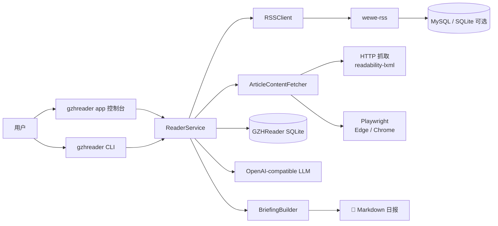

<div align="center">
  
  <h1>📰 GZHReader</h1>
  <p><strong>把微信公众号阅读流，整理成一份真正可保存、可回看、可继续加工的 AI 日报。</strong></p>

  <p>
    <a href="https://github.com/your-username/GZHReader/releases"></a>
    
    <a href="./LICENSE"></a>
    
  </p>
</div>


## 🌟 这是什么？

**你是否有这样的困扰：**

- 🤯 **信息过载，时间受限**：订阅了几十个公众号，每天面对铺天盖地的推送，由于工作学习繁忙，根本挤不出时间一一点开细看。
- 🔍 **沙里淘金，检索太难**：少数优质的高密度干货，轻而易举就被淹没在海量的新闻、推销和水文之中，难以快速提取。
- 🗑️ **阅后即没，无法沉淀**：很多好文章读完就消失在了时间线里，无法系统地归档、搜索与回顾，更别提进行笔记标注、知识库搭建和二次创作了。

**GZHReader 就是为此而生的。**

它是一个运行在你 Windows 本机的**微信公众号 AI 日报生成工具**。每天，它全自动地把你订阅的公众号文章拉取下来，经过大模型提炼，输出一份按公众号分组、干净整洁的 **Markdown 日报**——像读报纸一样，真正属于你，可存档、可搜索、可继续创作。

```
微信公众号  ──›  wewe-rss  ──›  GZHReader  ──›  📄 2026-03-10.md
 (扫码订阅)    (Docker容器)   (AI摘要引擎)        (今日精华日报)
```

**产品形态：GUI 为主，CLI 为辅；完全本地运行，支持打包成 Windows 安装程序，双击即用。**

---

## ✨ 核心亮点一览

| 特性 | 说明 |
| --- | --- |
| 🖥️ **向导式 Web 控制台** | 8 步可视化引导，从 Docker 检查到计划任务安装，全程图形操作，无命令行基础也能用 |
| 🌌 **现代暗黑美学 UI** | 前端 GUI 界面采用精心设计的现代暗黑主题（Dark Mode）布局，力求视觉美观与沉浸交互 |
| 🤖 **任意 LLM 接口** | `base_url` 可指向 OpenAI / Azure / DeepSeek / 本地 Ollama 等任意兼容接口，一行配置即换模型 |
| 🧠 **三重正文保障** | RSS 全文 → HTTP 抓取（readability-lxml）→ Playwright 浏览器渲染，层层保底确保每篇都有内容可读 |
| 📅 **Windows 计划任务** | 控制台一键安装/卸载，每天指定时间自动运行，无需你盯着电脑 |
| 🔒 **完全本地运行** | 文章和摘要全部落在本机 SQLite，无任何云端上传，数据主权在你自己 |
| ♻️ **智能去重** | 同一篇文章不重复处理，历史记录完整保留，支持查阅最近 20 份历史日报 |
| 📝 **纯 Markdown 产物** | 与 Obsidian / Notion / Logseq 无缝衔接，天然适合知识管理和二次加工创作 |
| 📦 **双模式可执行文件** | `GZHReader.exe`（静默启动）和 `GZHReader Console.exe`（带终端窗口便于调试），均可打成 Inno Setup 安装包 |

---

## 🤔 为什么值得用？

GZHReader 不仅仅是一个"阅读器"，而是一条高度自动化的本地知识加工流水线：

`微信公众号 → wewe-rss → all.atom → GZHReader → SQLite → LLM 总结 → Markdown 日报`

- 🖥️ **一站式管理**：用直观的图形控制台串起环境检查、RSS 服务、LLM 配置、结果输出和计划任务，所有操作不出这一个界面。
- 🎯 **零心智订阅**：不需要手工维护一堆 `feeds[]`，默认只消费一个聚合源 `all.atom`，公众号分类由文章元数据自动识别。
- 🔧 **智能正文补全**：遇到 RSS 抓取正文不完整的情况（微信限制很常见），补抓逻辑会依次尝试 HTTP 抓取和浏览器渲染，确保摘要有料可读。
- 📝 **Markdown 产物**：纯净的 Markdown 日报，非常适合归档、全文搜索、跨设备同步和二次深度创作。
- 🗄️ **本地存储保障**：运行记录和数据严格保存在本地 SQLite，方便重复执行、去重和历史追踪，真正把数据交还给你。

---

## 🚀 快速开始

### 👤 作为最终用户（推荐）

1. 安装并启动 **Docker Desktop**（必备前提）。
2. 下载并运行 `GZHReader.exe`，浏览器会自动打开控制台。若未安装 Docker Desktop 此处会有引导安装页。
3. 按向导 **第 1 步**：检查本地环境（Docker、浏览器驱动等）。
4. 按向导 **第 2 步**：一键启动 `wewe-rss` 容器。
5. 按向导 **第 3 步**：打开 wewe-rss 后台，扫码登录并订阅公众号。
6. 按向导 **第 4 步**：填写你的 **LLM 接口配置**（支持任意 OpenAI 兼容接口）。
7. 按向导 **第 5～6 步**：选择日报输出目录，设置每日运行时间。
8. 按向导 **第 7 步**：点击"立即运行"生成今天的第一份日报。
9. *(可选)* 按向导 **第 8 步**：一键安装为 **Windows 每日计划任务**，从此全自动。

---

> **⚠️ 重要提示：关于 WeWe RSS 端点掉线的说明**
> 由于引用的开源项目 [WeWe RSS](https://github.com/cooderl/wewe-rss) 存在已知 Bug，当前在使用过程中**可能需要每次重新登录 / 重新配置**微信扫码才能正常拉取文章。若发现系统提示拉取失败或文章无法更新，请前往本地的 wewe-rss 后台重新扫码登录微信。

---

### 🛠️ 从源码运行（面向开发者）

```powershell
# 1. 建立虚拟环境（需要 Python >= 3.11）
python -m venv .venv
.\.venv\Scripts\activate

# 2. 安装依赖并以可编辑模式链接项目
pip install -e .

# 3. 生成默认配置文件
gzhreader init

# 4. 启动图形界面控制台
gzhreader app
```

### ⌨️ 常用 CLI 命令清单

GZHReader 为喜欢终端的用户保留了完整的命令行支持：

```powershell
gzhreader init                # 生成默认 config.yaml 和 wewe-rss 脚手架
gzhreader app                 # 启动 Web 图形控制台（默认 127.0.0.1:8765）
gzhreader doctor              # 全面诊断本地运行环境健康度
gzhreader run today           # 立即执行一次今日日报生成
gzhreader run date 2026-03-07 # 指定日期生成日报，例如3月7号
gzhreader schedule install    # 安装 Windows 计划任务（每日自动运行）
gzhreader schedule remove     # 卸载 Windows 计划任务
gzhreader wewe-rss init       # 生成 wewe-rss Docker Compose 及 .env 文件
gzhreader wewe-rss up         # 启动 wewe-rss 容器
gzhreader wewe-rss down       # 停止 wewe-rss 容器
gzhreader wewe-rss logs       # 查看 wewe-rss 容器日志
```

---

## 🏗️ 架构与数据流

GZHReader 整体运作流程高度解耦：



### 🧩 一次完整运行的心智模型

1. `wewe-rss` 将公众号内文转化为标准 Atom 格式，对外暴露 `/feeds/all.atom`。
2. `RSSClient` 拉取聚合源，按配置的日期窗口（`day_start`）和数量上限（`daily_article_limit`）精准过滤。
3. 逐条判断正文是否够用（默认阈值 400 字）；不足时，`ArticleContentFetcher` 依次尝试 HTTP 抓取和 Playwright 浏览器渲染补完。
4. 通过 `Storage` 写入本地 SQLite，URL + 内容指纹双重去重，保证幂等。
5. `OpenAICompatibleSummarizer` 对所有待摘要文章发起 LLM 请求，生成 2～4 句中文精华摘要。
6. `BriefingBuilder` 按公众号名（`feed_name`）分组，渲染为格式化 Markdown，输出至 `output/briefings/YYYY-MM-DD.md`或者`你选择的目录/YYYY-MM-DD.md`。

**正文来源优先级**（由高到低）：

| 优先级 | `content_source` | 说明 |
| --- | --- | --- |
| ① | `rss_content` | RSS 全文（最优，无需补抓） |
| ② | `http_fulltext` | httpx + readability-lxml 提取 |
| ③ | `browser_dom` | Playwright 浏览器渲染 |
| ④ | `rss_summary` | RSS 摘要字段 |
| ⑤ | `title_only` | 仅有标题（最差，尽量避免） |

---

## 📁 代码结构地图

如果你想修改或研究源码，以下地图能帮你快速定位：

```
src/gzhreader/
├── __init__.py           # 唯一版本号定义（__version__ = "1.0.0"）
├── __main__.py           # 支持 python -m gzhreader 调用的入口
│
├── ── 入口层 ──
├── cli.py                # 全部 CLI 命令定义（Typer）：init / app / doctor / run / schedule / wewe-rss
├── webapp.py             # FastAPI Web 应用 + DashboardBackend，实现所有 GUI 路由和 HTMX 局部刷新
├── console_entry.py      # GZHReader Console.exe 入口（带终端窗口，方便调试）
├── gui_entry.py          # GZHReader.exe 入口（静默启动，系统托盘友好）
│
├── ── 业务编排层 ──
├── service.py            # ReaderService：核心流程编排（拉取 → 补抓 → 去重 → 摘要 → 生成日报）
├── briefing.py           # BriefingBuilder：将文章视图列表渲染为格式化 Markdown 日报
│
├── ── 基础能力层 ──
├── rss_client.py         # RSSClient：feedparser + httpx 拉取并解析 RSS/Atom，处理日期窗口过滤
├── article_fetcher.py    # ArticleContentFetcher：HTTP（readability-lxml）和 Playwright 双通道正文补抓
├── summarizer.py         # OpenAICompatibleSummarizer：调用任意 OpenAI 兼容接口生成摘要，支持连通性自检
├── storage.py            # Storage：SQLite 存储层，管理 feeds / articles / runs / briefings 四张表
│
├── ── 环境与配置层 ──
├── config.py             # Pydantic v2 配置模型（AppConfig），含旧版配置自动迁移逻辑
├── runtime_paths.py      # 路径解析：自适应开发环境和 PyInstaller 打包环境（%APPDATA%/GZHReader）
├── scheduler.py          # Windows 计划任务管理（通过 PowerShell 调用 schtasks.exe）
├── wewe_rss.py           # WeWeRSSManager：生成 Docker Compose 文件，封装容器 up/down/logs/status
├── logging_utils.py      # 日志配置工具（根据 log_level 配置结构化日志）
│
└── ── 资源层 ──
    ├── types.py           # 核心数据类型：FeedArticle / ArticleDraft / StoredArticle / ArticleView 等
    ├── embedded_assets.py # 嵌入式前端资源（htmx.min.js），打包后不依赖外部 CDN
    ├── static/            # 静态资源（品牌图标、vendor JS）
    └── templates/         # Jinja2 HTML 模板（dashboard、briefing 预览、向导步骤局部片段）
```

---

## ⚙️ 配置参考

配置文件默认位于 `config.yaml`，运行 `gzhreader init` 可生成带注释的模板文件。以下是核心配置项：

```yaml
# 数据库
db_path: ./data/gzhreader.db

# 聚合源（指向 wewe-rss 暴露的 all.atom）
source:
  url: http://localhost:4000/feeds/all.atom

# RSS 拉取行为
rss:
  timezone: Asia/Shanghai     # 发布时间归属时区
  day_start: "00:00"          # 每日日报起算时刻
  daily_article_limit: 20     # 每日最多处理文章数，"all" 表示不限制

# wewe-rss 集成
wewe_rss:
  base_url: http://localhost:4000
  auth_code: "123567"         # wewe-rss 后台访问码（非微信密码！）
  compose_variant: mysql      # 存储后端：mysql 或 sqlite

# 正文补抓
article_fetch:
  enabled: true
  mode: hybrid                # 先 HTTP，失败则浏览器（Playwright）
  max_content_chars: 12000    # 正文截断上限（送 LLM 前）

# LLM 配置（支持任意 OpenAI 兼容接口）
llm:
  base_url: https://api.openai.com/v1
  api_key: ""                 # 也可用环境变量 OPENAI_API_KEY
  model: gpt-4o-mini
  temperature: 0.2

# 输出
output:
  briefing_dir: ./output/briefings
  save_raw_html: false        # 是否同时保存原始 HTML 归档

# 计划任务
schedule:
  daily_time: "21:30"         # 每日自动运行时刻
```

完整配置项及说明请参见 [config.example.yaml](config.example.yaml)。

---

## 🧱 组件全景与答疑

### 核心组件对照表

| 核心组件 | 是否必需 | 承担的作用 | 普通用户需要关心吗？ |
| --- | --- | --- | --- |
| **Docker Desktop** | ✅ 是 | 在本机提供运行 `wewe-rss` / MySQL 的基座容器环境 | **要**，必须事先安装并保持运行 |
| **`cooderl/wewe-rss:latest`** | ✅ 是 | 提供获取微信文章的通道能力，并对外通过 Web 后台展现 | **要**，需要在控制台中启动它 |
| **`mysql:8.4`** | 仅 `compose_variant: mysql` 时 | 为 `wewe-rss` 提供存储层 | 发行版默认无需特别关心 |
| **GZHReader SQLite** | ✅ 是 | GZHReader 专属存储（文章去重、执行日志、生成的摘要） | 后台静默运行，无需手动打理 |
| **Markdown 日报** | ✅ 是 | 系统的最终精华产物，提供绝佳的离线阅读及归档体验 | **最重要**，这就是你的阅读结果 |

### 🔑 几个关键密码释疑

- **AUTH_CODE**：仅是本地 `wewe-rss` 后台的访问门票，绝非你的微信密码或大模型 API Key。
- **MySQL 密码**：容器内部通讯用的自建凭证，不直接操作数据库的话完全透明；使用 `compose_variant: sqlite` 则完全不需要关心。

---

## 🛠️ 技术栈速览

| 层次 | 主要技术 |
| --- | --- |
| **Web 框架** | FastAPI + Uvicorn |
| **前端交互** | Jinja2 模板 + HTMX（无 JS 框架依赖） |
| **CLI 框架** | Typer |
| **配置验证** | Pydantic v2 + PyYAML |
| **RSS 解析** | feedparser |
| **HTTP 客户端** | httpx |
| **正文提取** | BeautifulSoup4 + readability-lxml |
| **浏览器自动化** | Playwright（msedge / chrome 通道） |
| **数据存储** | SQLite（内置，零外部依赖） |
| **容器管理** | Docker Compose（subprocess 调用） |
| **打包** | PyInstaller 6 + Inno Setup 6 |
| **测试** | pytest |

---

## 📋 CHANGELOG

本项目的 `CHANGELOG.md` 是每次发版不可或缺的部分：
- 提醒开发者修补了什么、引入了什么新机制。
- 给终端用户提供真实的升级决策依据。
- 在 GitHub Release 中作为发版说明的第一手材料。

参与协作时，请在提交新功能或修复前顺手更新 [CHANGELOG.md](CHANGELOG.md)。

---

## ❓ FAQ


**Q：为什么只需要一个 `source` 聚合源？**
A：通过接 `all.atom` 聚合通道，用户完全摆脱了手动维护大量 feed 列表的苦海。wewe-rss 会把你订阅的所有公众号汇聚到这一个端点。

**Q：既然只有一个源，报表里怎么还能分清不同公众号？**
A：聚合内容本身自带作者和元数据标识，GZHReader 会利用 `feed_name`（作者名/公众号名）字段自动分组归类。

**Q：我看不到原始 HTML，只有 Markdown 吗？**
A：默认是的。阅读与归档的本质是剥离噪音。如果需要保留原始网页，在配置中开启 `output.save_raw_html: true` 即可。

**Q：没有 OpenAI API Key 还能用吗？**
A：可以运行，但摘要功能会降级为文本截断而非 AI 生成。建议配置任意 OpenAI 兼容接口（包括免费的本地 Ollama）以获得完整体验。

---

## ⚠️ 免责声明

本项目依赖若干第三方服务及外部开源方案（包含但不限于 Docker Desktop、`wewe-rss` 与 OpenAI 兼容大模型 API），且文章数据皆受其平台使用限制约束。本工具的使用及因此所引发的风险等一概由使用者自理，本库提供的内容不构成最终正式承诺。请确保你的合理使用符合各大平台的合规章程。
